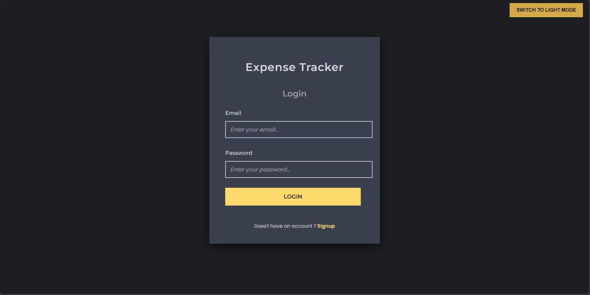
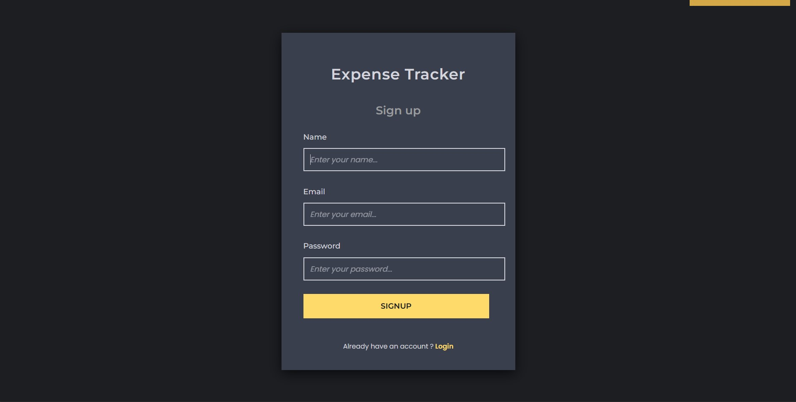
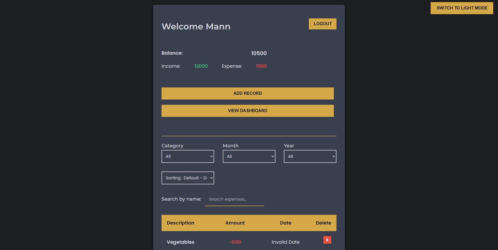
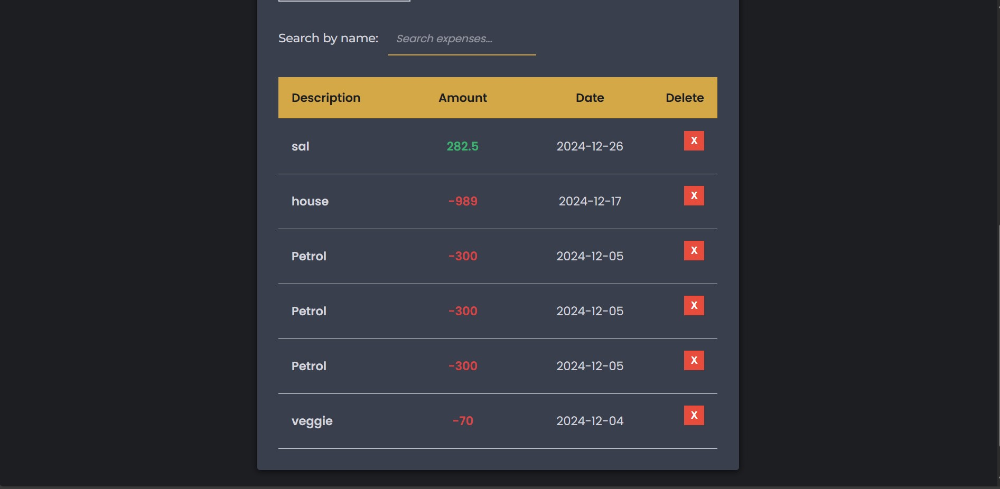
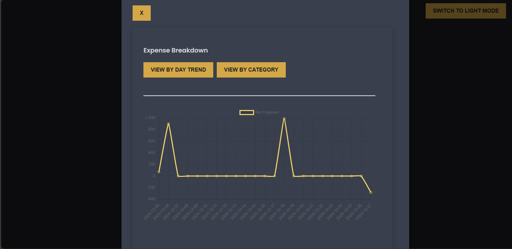
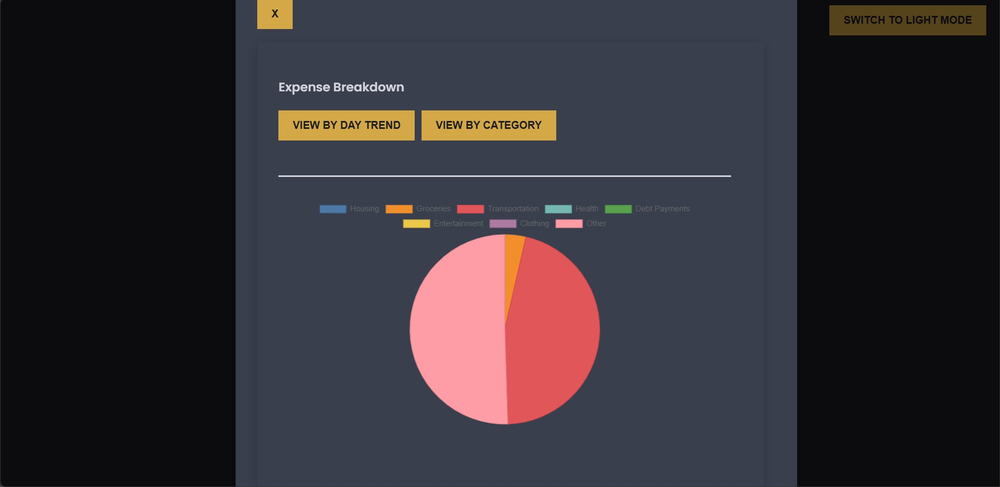

# Expense Tracker: Simplifying Financial Management

## Contributors
-- Fung, Pak Hin 
-- Lee, Wing Tung 
-- Shah, Mann V 
-- Theverukattil John, Brayan 


## Overview
Expense Tracker is a modern, user-friendly application that helps you seamlessly manage your income and expenses. With features like record addition, visual insights via graphs, and category-wise breakdowns, Expense Tracker is your ultimate tool for financial tracking and planning.


---

## How It Works

Effortlessly track your expenses and income. The app lets you:

- *Log financial records with descriptions and amounts.
- *View balance, total income, and expenses at a glance.
- *Explore detailed breakdowns with graphical representations, including line graphs and pie charts.

---


## Key Features
- *User Authentication: Secure login and signup functionality.
- *Expense Management: Add, view, and delete expense records.
- *Graphical Insights: Interactive line graphs for trend analysis and pie charts for category distribution.
- *Filter & Search: Filter records by category, date, and search by name.
- *Dark/Light Mode: Toggle between themes for a comfortable user experience.


---

## Technology Behind Expense-Tracker
- *Frontend: Built using React.js for a responsive and dynamic user interface. Integrated Chart.js and React-Chartjs-2 for rich data visualization. Notifications are powered by React-Toastify for a seamless user experience.
- *Backend: Powered by Node.js and Express.js for efficient server-side processing. User authentication is secured with JWT and bcrypt, while Joi ensures input validation.
- *Database: Managed with MongoDB, offering scalable and reliable data storage solutions.
- *State Management: Simple and effective component-based state management within React.
- *Styling: Minimal and clean UI designed with modern CSS practices for a professional look and feel.

---

## Getting Started

1. Clone the repository:
   ```
   git clone [repository URL]
   ```

2. Install backend dependencies:
   ```
   cd Backend
   npm install
   ```

3. Install frontend dependencies:
   ```
   cd ../Frontend
   npm install
   ```

## Running the Application

1. Start the backend server:
   ```  
   cd Backend
   node run dev
   ```

2. In a new terminal, start the frontend:
   ```
   cd Frontend
   npm run dev
   ```

3. Open your browser and navigate to http://localhost:5173

## Screenshots













---

## Usage Instructions

1.	Sign Up:
	- *Navigate to the Signup page.
	- *Enter your name, email, and password to create an account.
2.	Login:
	- *Use your registered email and password to log in.
3.	Dashboard Overview:
	- *View your Balance, Total Income, and Expenses at the top.
	- *Explore your financial records in the expense table below.
4.	Add a Record:
	- *Click on the "Add Record" button.
	- *Enter the details (e.g., description, amount, and category) and save the record.
5.	Filter and Search Records:
	- *Use the filters (Category, Month, Year) or the search bar to find specific records.
6.	View Insights:
	- *Navigate to the Dashboard to view:
	- *Line Graph: Tracks expense trends over time.
	- *Pie Chart: Displays expenses by category.
7.	Delete Records:
	- *Click the red Delete button next to a record to remove it.
8.	Toggle Themes:
	- *Switch between Dark Mode and Light Mode using the toggle button for a personalized experience.
9.	Logout:
	- *Click the Logout button to securely exit your session.


